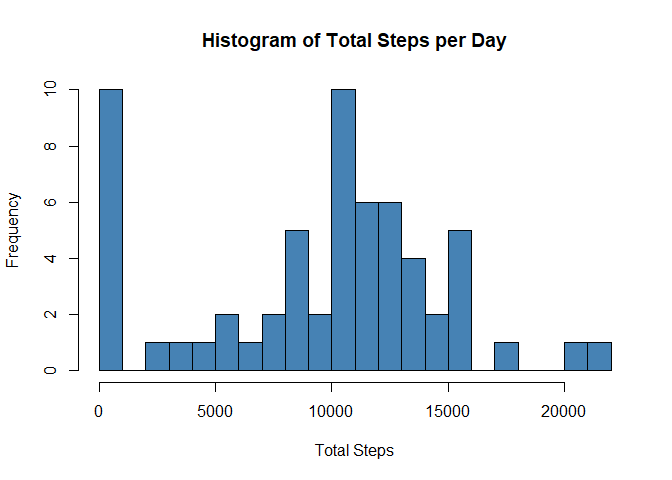
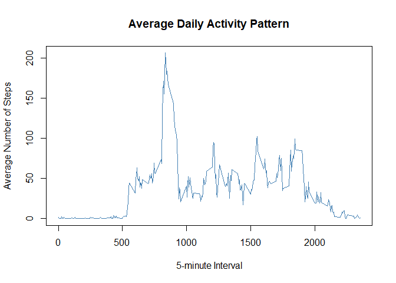
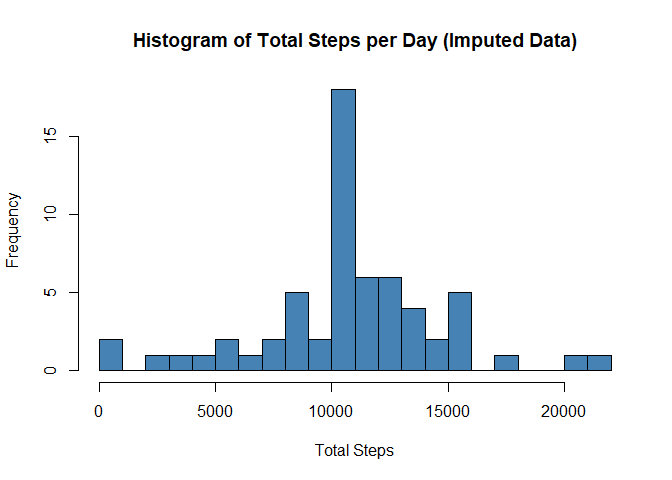
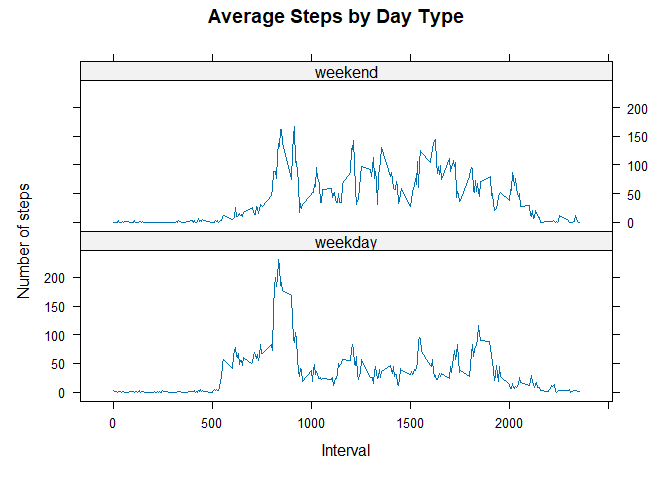

## Loading and preprocessing the data


``` r
# Load required libraries
library(ggplot2)
library(dplyr)
```

```
## 
## Attaching package: 'dplyr'
```

```
## The following objects are masked from 'package:stats':
## 
##     filter, lag
```

```
## The following objects are masked from 'package:base':
## 
##     intersect, setdiff, setequal, union
```

``` r
library(lattice)

# Read the data
activity <- read.csv("activity.csv")

# Convert date column to Date type
activity$date <- as.Date(activity$date)
```

## What is mean total number of steps taken per day?


``` r
# Calculate total steps per day
steps_per_day <- activity %>%
  group_by(date) %>%
  summarise(total_steps = sum(steps, na.rm = TRUE))

# Create histogram
hist(steps_per_day$total_steps, 
     main = "Histogram of Total Steps per Day",
     xlab = "Total Steps",
     col = "steelblue",
     breaks = 20)
```

<!-- -->

``` r
# Calculate mean and median
mean_steps <- mean(steps_per_day$total_steps, na.rm = TRUE)
median_steps <- median(steps_per_day$total_steps, na.rm = TRUE)
```

The mean number of steps taken per day is 9354.2295082 and the median is 10395.

## What is the average daily activity pattern?


``` r
# Calculate average steps per interval
avg_steps_interval <- activity %>%
  group_by(interval) %>%
  summarise(avg_steps = mean(steps, na.rm = TRUE))

# Create time series plot
plot(avg_steps_interval$interval, 
     avg_steps_interval$avg_steps, 
     type = "l",
     main = "Average Daily Activity Pattern",
     xlab = "5-minute Interval",
     ylab = "Average Number of Steps",
     col = "steelblue")
```

<!-- -->

``` r
# Find interval with maximum steps
max_interval <- avg_steps_interval$interval[which.max(avg_steps_interval$avg_steps)]
max_steps <- max(avg_steps_interval$avg_steps)
```

The 5-minute interval with the maximum number of steps is 835, with an average of 206.1698113 steps.

## Imputing missing values


``` r
# Calculate total number of missing values
total_na <- sum(is.na(activity$steps))

# Create new dataset with imputed values
# Strategy: Use mean for that 5-minute interval
activity_imputed <- activity %>%
  group_by(interval) %>%
  mutate(steps = ifelse(is.na(steps), mean(steps, na.rm = TRUE), steps))

# Calculate total steps per day with imputed data
steps_per_day_imputed <- activity_imputed %>%
  group_by(date) %>%
  summarise(total_steps = sum(steps))

# Create histogram with imputed data
hist(steps_per_day_imputed$total_steps,
     main = "Histogram of Total Steps per Day (Imputed Data)",
     xlab = "Total Steps",
     col = "steelblue",
     breaks = 20)
```

<!-- -->

``` r
# Calculate new mean and median
mean_steps_imputed <- mean(steps_per_day_imputed$total_steps)
median_steps_imputed <- median(steps_per_day_imputed$total_steps)
```

The total number of missing values in the dataset is 2304.

After imputing missing values:
- New mean: 1.0766189\times 10^{4}
- New median: 1.0766189\times 10^{4}

## Are there differences in activity patterns between weekdays and weekends?


``` r
# Add weekday/weekend factor
activity_imputed <- activity_imputed %>%
  mutate(day_type = ifelse(weekdays(date) %in% c("Saturday", "Sunday"), 
                          "weekend", "weekday"))

# Calculate average steps by interval and day type
avg_steps_by_day_type <- activity_imputed %>%
  group_by(interval, day_type) %>%
  summarise(avg_steps = mean(steps))
```

```
## `summarise()` has grouped output by 'interval'. You can override using the
## `.groups` argument.
```

``` r
# Create panel plot
xyplot(avg_steps ~ interval | day_type, 
       data = avg_steps_by_day_type,
       type = "l",
       layout = c(1, 2),
       xlab = "Interval",
       ylab = "Number of steps",
       main = "Average Steps by Day Type")
```

<!-- -->

The panel plot above shows the differences in activity patterns between weekdays and weekends. The top panel represents weekend days, while the bottom panel represents weekdays. Overall they are similar though weekdays receive a bigger spike at around the 850 interval.
